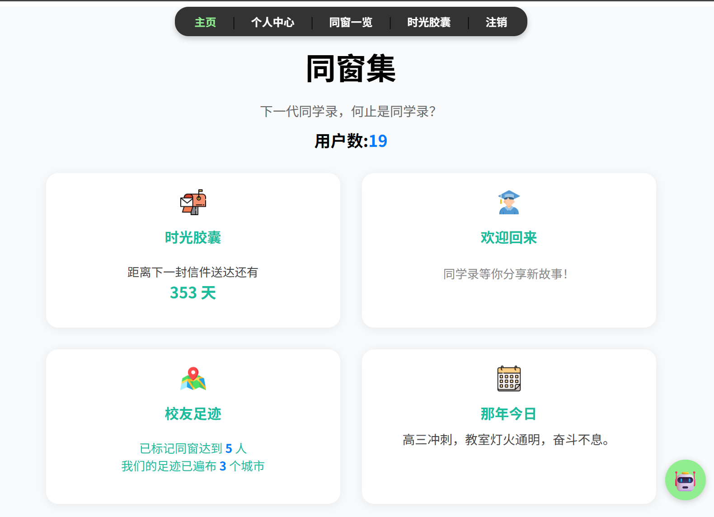
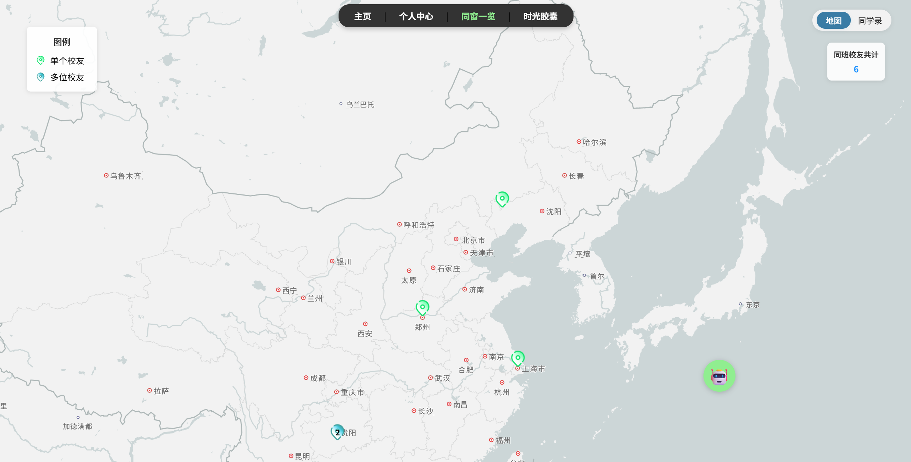
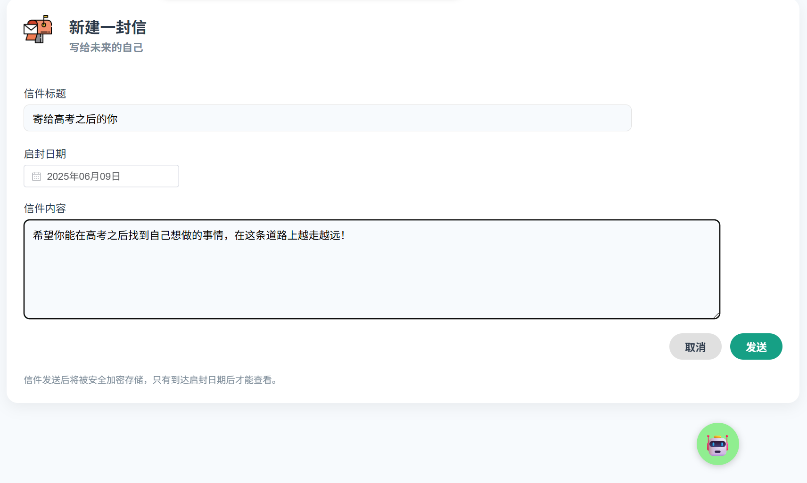

# AlumniSphere 功能详解

---

### **一、 用户认证系统 (注册与登录)**

核心目标是保障平台安全，为每位校友建立唯一的数字身份。

---

### **二、 核心浏览功能**

#### 1. 首页 (HomeView)

作为平台的门户，为用户提供信息概览和快速导航。

#### 2. 同学录 (AllAlumniesView)

集中展示所有校友信息，是平台的核心功能之一。

- **卡片式展示 ``**: 以现代化的卡片布局，清晰地展示每位校友的摘要信息。

#### 3. 校友地图 (MapView)

以地理维度将校友网络可视化，提供独特的探索体验。

- **地理位置分布 ``**: 在地图上直观展示校友的全球或全国分布情况。
- **标记点交互 ``**: 点击地图上的标记，可以预览该校友的详细信息。
- **视图切换**: 支持从地图视图一键跳转至卡片式的“同学录”界面。

---

### **三、 个人空间与互动**

#### 1. 个人中心 (ProfileView)

用户管理自己数字身份的专属空间。

- **资料编辑**: 用户可在此页面编辑和更新自己的个人资料。
- **头像上传**: 支持自定义更换个人头像。
- **语音介绍**: 用户可以录制一段独特的语音，可作为个人介绍，在用户允许下也可用作语音克隆。

#### 2. 个人介绍页 (UserInformationView)

深入了解单个校友的详情页面。

- **信息聚合**: 集中展示某位校友的所有公开信息。
- **语音交流**: 核心亮点功能，可以在用户允许下，基于TA上传的语音，进行语音克隆，允许其它同学与TA进行语音对话。

#### 3. 未来寄语 (FutureView)

一个充满仪式感和情感连接的特色功能。

- **给未来的信**: 用户可以为未来的自己写下一封信，设定一个未来的开启日期。
- **信件管理**: 平台支持查看所有已写的信件，并清晰地区分“已启封”和“未启封”两种状态。
- **语音读信**：平台能根据用户的声音，生成过去的自己写给未来的自己的音频，更有沉浸感。

---

### **四、 AI 智能交互功能**

#### 1. 智能问答 (SmartqView)

平台的 AI 助手，提供信息检索和智能解答服务。

- **悬浮球入口 ``**: 用户可以通过页面上的悬浮球随时唤起 AI 问答界面。
- **校友问题解答 ``**: AI 能够理解并回答关于校友的特定问题（如“XX级的校友现在主要在哪些城市？”）。
- **大学相关问答 ``**: AI 也具备解答与母校相关问题的能力，成为一个校园知识库。

#### 2. 与TA对话 (CalltaView)

基于声音克隆和 AI 技术的深度交互功能。

- **声音驱动 ``**: 此功能基于目标校友在“个人中心”录制的语音介绍。
- **模拟语音交流 ``**: 用户可以与这位校友的“AI分身”进行实时的语音对话。

---

### **五、 相关图片**

